# Cortical

## 1. What you rate

- You look at the FreeSurfer cortical segmentation: 68 colored labels (34 regions per hemisphere).
- First, look over the whole brain in all views to check whether the labels follow the cortex.
- When you spot an error, identify the region to see which lobe it belongs to.
- Rate each lobe, left and right: **frontal, parietal, temporal, occipital, cingulate, insula**. If any region in a lobe has an error, the whole lobe fails.

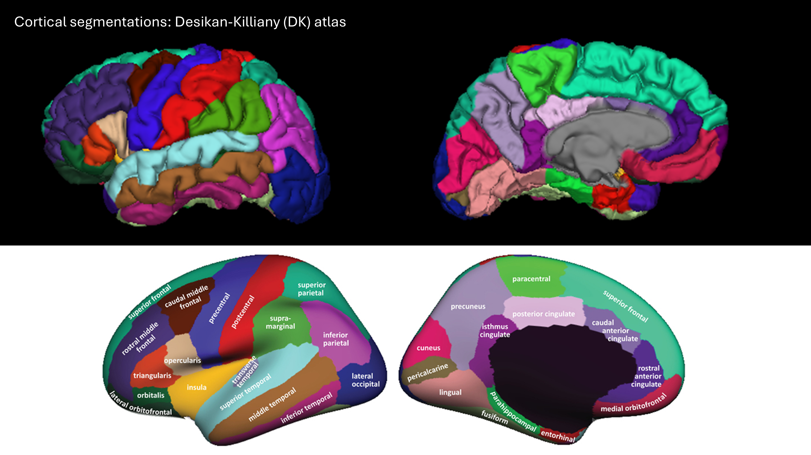

**Desikan-Killiany atlas:** the 34 cortical regions per hemisphere, shown from the lateral (outer) and medial (inner) side. When you spot an error, use the color to identify the region, then find its lobe in the table above.

*Note: the insula is largely hidden behind the frontal and temporal lobes in the lateral view, and the entorhinal and parahippocampal regions sit on the underside of the temporal lobe, at the bottom edge of the medial view. Judge these on what you can see, and be lenient.*

### Which regions belong to which lobe?

| Lobe | Regions |
|---|---|
| **Frontal** | superior frontal, rostral middle frontal, caudal middle frontal, pars opercularis, pars triangularis, pars orbitalis, lateral orbitofrontal, medial orbitofrontal, precentral, paracentral, frontal pole |
| **Parietal** | superior parietal, inferior parietal, supramarginal, postcentral, precuneus |
| **Temporal** | superior temporal, middle temporal, inferior temporal, banks of superior temporal sulcus, fusiform, transverse temporal, entorhinal, parahippocampal, temporal pole |
| **Occipital** | lateral occipital, lingual, cuneus, pericalcarine |
| **Cingulate** | rostral anterior cingulate, caudal anterior cingulate, posterior cingulate, isthmus cingulate |
| **Insula** | insula |

## 2. What you see in QC-Studio

## 3. What to check and how to rate

| Problem | Question to ask | What it looks like | Still PASS | FAIL |
|---|---|---|---|---|
| **Overestimation** | Does each region stay within its own area? | A region is too large. It can spread into a neighboring region (its color covers part of the neighbor), or include non-brain tissue that sticks out of the surface as a bump, spike, or blob. Non-brain tissue is most common at the bottom of the frontal, temporal, and occipital lobes. | Slightly too large, or a small bump | Clearly too large, takes over a neighbor, or a large blob that isn't brain |
| **Underestimation** | Is each region complete? | A region is too small. Part of it is missing, which shows up as a dent, hole, or flattened area, or its area is taken over by a neighbor. Most common at the temporal pole, frontal pole, and the entorhinal and parahippocampal regions. | Slightly too small, or a small dent | A large part of the region is missing, or a pole is flat or gone |
| **Rough surface** | Does the surface look smooth, with normal gyri and sulci? | The surface looks jagged, spiky, or shriveled. This is often caused by motion or poor scan quality. | Slight roughness | A region looks clearly jagged or shriveled |

## 4. Examples and common problems

| Rating | What it looks like | Example |
|---|---|---|
| **PASS** | Labels follow known anatomical boundaries, gray matter is properly segmented, no under- or overestimation | 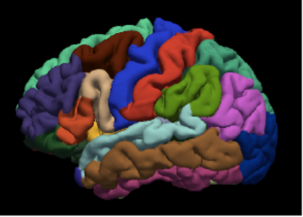{ width="250" } |
| **FAIL** | Processing error | 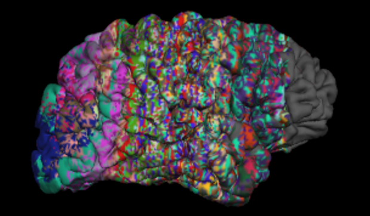{ width="250" } |
| **FAIL** | Frontal part of the brain missing because of pathology | 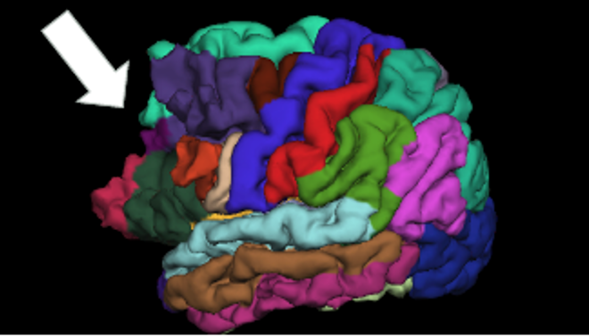{ width="250" } |

### Common problems per lobe

| Lobe | Region | What happens | Rating | Example |
|---|---|---|---|---|
| **Frontal** | Frontal pole | Underestimated: the tip of the frontal lobe is not fully labeled (fewer than 10% of scans) | FAIL only if a large part is missing | |
| **Frontal** | Precentral and postcentral | The two gyri overlap: the labels run into each other, sometimes also into the superior parietal, superior frontal, or caudal middle frontal regions (fewer than 15% of scans) | FAIL frontal and parietal | 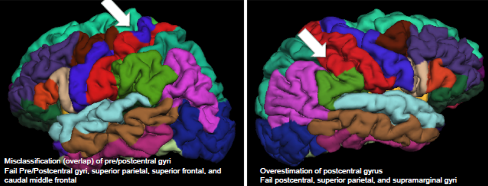{ width="250" } |
| **Parietal** | Postcentral | Overestimated: extends into the superior parietal and supramarginal regions | FAIL parietal | See image above. |
| | Supramarginal | Overestimated: extends into the superior temporal gyrus. Exact borders are hard to judge and anatomy varies | Be lenient. FAIL only if severe | 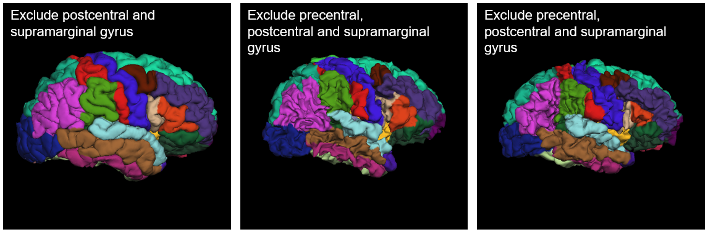{ width="250" } |
| | Superior parietal | Overestimated: extends into the precuneus and cuneus | FAIL parietal if severe. Also fail occipital if the cuneus is clearly affected | 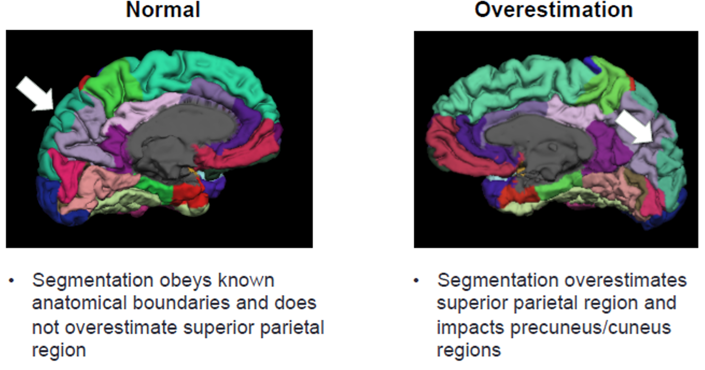{ width="250" } |
| **Temporal** | Temporal pole | Underestimated: the tip of the temporal lobe is not fully labeled (fewer than 10% of scans) | FAIL only if a large part is missing | |
| | Banks of STS | Appears on the gyral surface instead of in the sulcus (20 to 30% of scans) | PASS. FAIL only if it's so large that it takes over the superior or middle temporal gyrus | 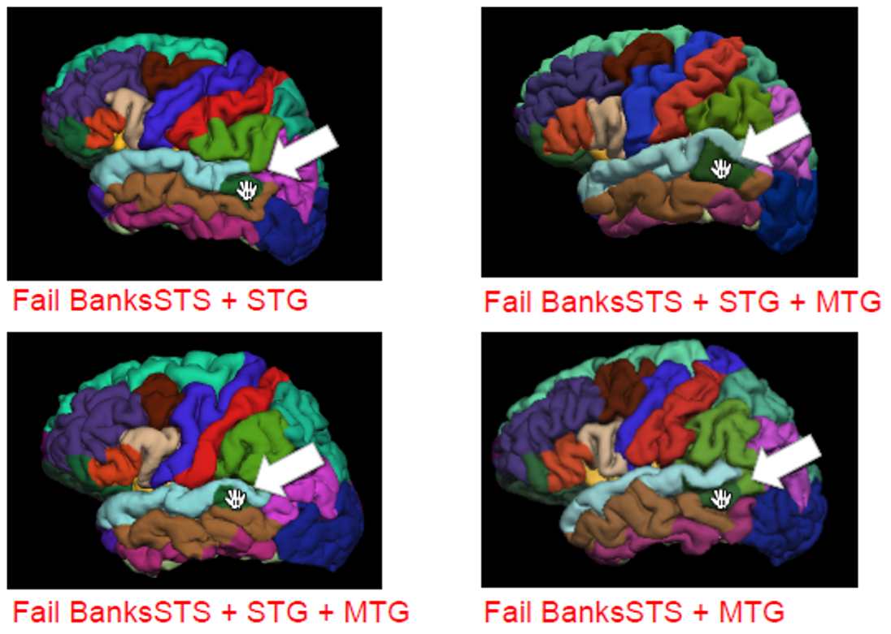{ width="250" } |
| | Middle and inferior temporal | The middle temporal gyrus seems to cover the inferior temporal gyrus. This is usually due to the angle of the brain, and some overlap is normal | PASS | 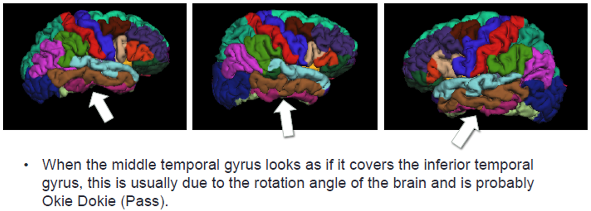{ width="250" } |
| | Entorhinal | Often only partly labeled correctly, in a large share of scans | Be lenient. FAIL only if more than 50% of the region is poorly segmented | 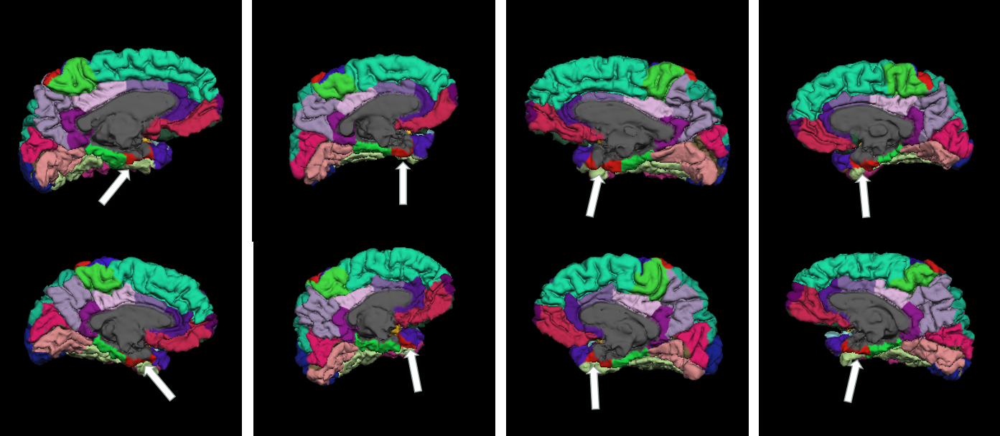{ width="250" } |
| | Entorhinal and parahippocampal | Part of the gray matter is labeled as ventricle instead of cortex | FAIL if a large part of the gyrus is missing | { width="250" } |
| **Occipital** | Pericalcarine | Overestimated, also affecting the lingual and cuneus regions (fewer than 5% of scans) | FAIL if clearly overestimated | 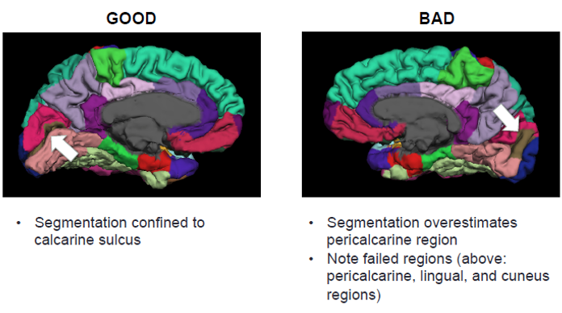{ width="250" } |
| **Cingulate** | All cingulate regions | Anatomy and segmentation vary a lot between people | Be lenient. FAIL only if clearly wrong | 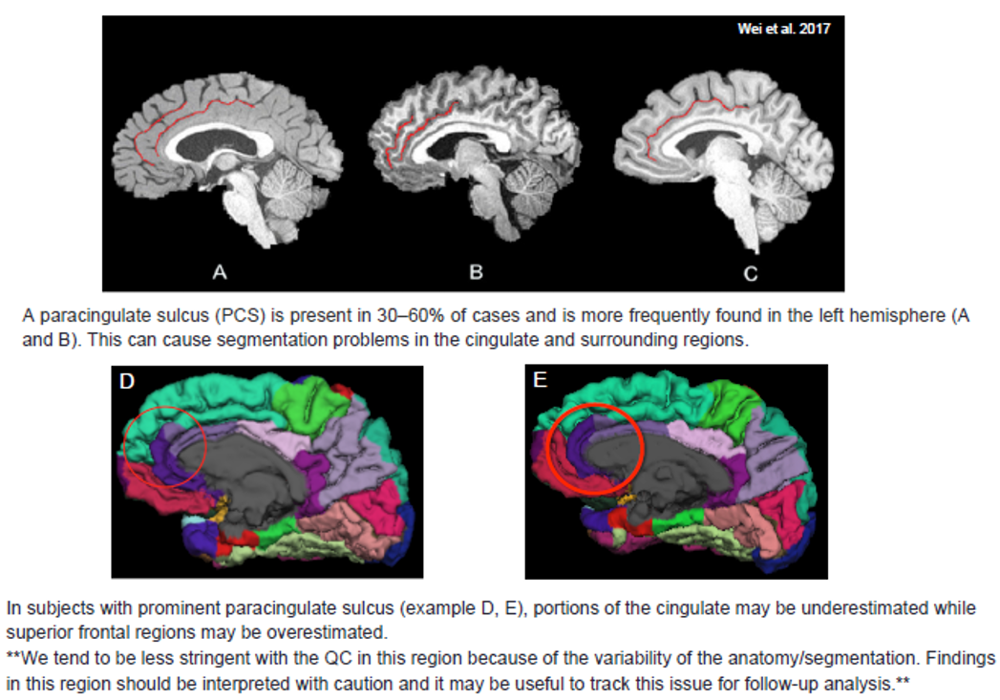{ width="250" } |
| **Insula** | Insula | The atlas has no label for the subgenual anterior cingulate, so that area is sometimes labeled as insula or medial orbitofrontal | Be lenient. This alone is a PASS | 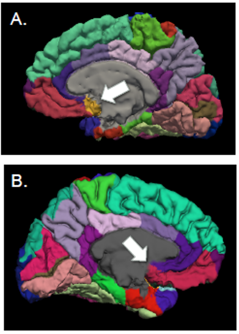{ width="250" } |

### Other situations

| Situation | What to do |
|---|---|
| A problem in one hemisphere only | Fail only that side |
| The same problem in several lobes (for example after a skull-strip failure) | Fail each affected lobe |
| An overestimated region spills into a region of another lobe | Fail the lobe of the overestimated region, and also the other lobe if the neighbor is clearly affected |
| The T1 quality was poor, but the labels look correct | PASS. Rate the segmentation, not the scan |
| A problem visible in only one view | Rate based on that view |
| The meninges (the membranes around the brain) are included in the segmentation, so the surface looks thickened, lumpy, or smoothed over the gyri (see image below) | PASS if it's a thin or small area. FAIL the affected lobe(s) if it covers a large area |

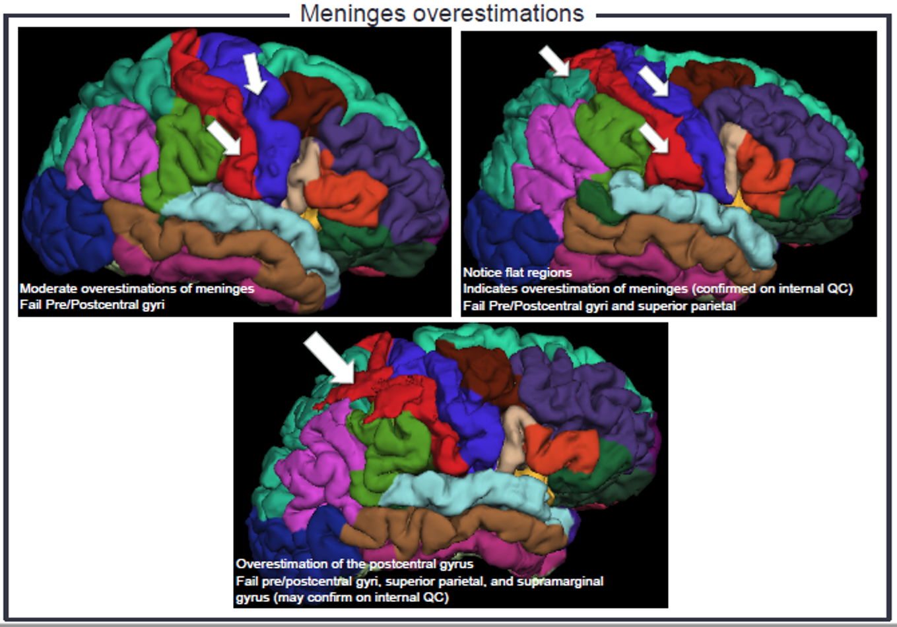

