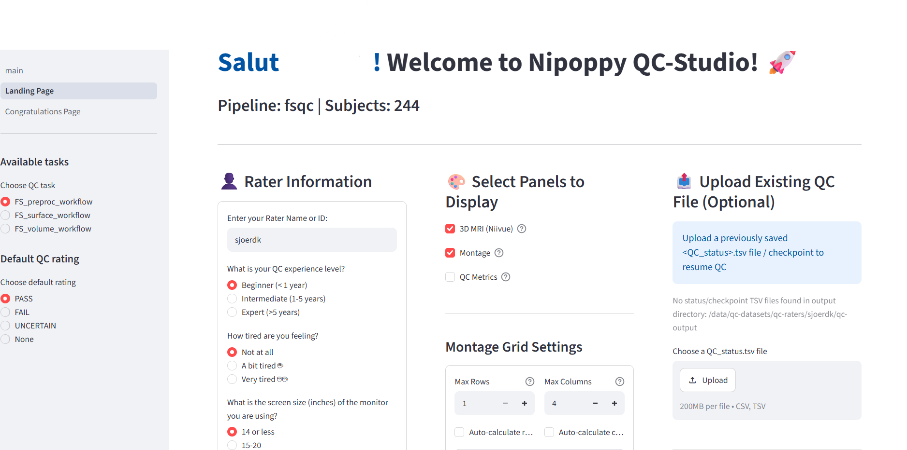

# PPMI FreeSurfer Visual QC: Overview

## Goal

- Check the quality of the PPMI baseline T1 scans and their FreeSurfer 7 segmentations.
- Decide which regions and participants can be safely included in ENIGMA-PD analyses.
- Even small errors can bias results, so a careful visual check matters.
- Your ratings are also used to measure how consistently we rate, both between raters and within the same rater.

## The three tasks

| Order | Task | What you rate | Rated per |
|---|---|---|---|
| 1 | [T1 quality](t1_quality.md) | The skullstripped T1w image, before processing | 4 criteria: motion, coverage, signal and contrast, other. |
| 2 | [Cortical](cortical.md) | FreeSurfer cortical segmentation | 6 lobes, left and right; if you see an error in a region, look up which lobe it belongs to (see the table in the cortical guide) and fail that whole lobe |
| 3 | [Subcortical](subcortical.md) | FreeSurfer subcortical segmentation | 10 regions, left and right, plus the brainstem unilaterally |

- Do the cortical task before the subcortical task. It trains your eye for spotting failed segmentations.
- Each task has its own guide with examples.

## Rating scale

| Rating | When to use it |
|---|---|
| PASS | No problems, or only minor ones that won't affect the measurement |
| UNCERTAIN | Only if you really can't decide between PASS and FAIL after checking all views. Add a comment explaining why |
| FAIL | A clear, severe problem that makes the region or scan unreliable |

At the end of each task you'll get a recap that lists your UNCERTAIN ratings. Go back to each one and try to choose PASS or FAIL. Keep UNCERTAIN only if you still can't decide and **always add a comment** to explain why.

## Inter- and intra-rater reliability

- Some of your participants are also assigned to other raters, so we can compare ratings between raters.
- The secondary list contains participants you already rated. Let us know whenever you have completed the primary list and we will change it for the secondary list. Rate them again without looking back at your first rating, so we can check how consistent each rater is.

## General rules

- **Be lenient.** Fail only clear, severe errors. Small flaws and mild asymmetries are normal.
- **Check all views** (sagittal, coronal, axial) before you decide. Some problems only show up in one view.
- **Warm up first.** Rate your first 5 to 10 participants, then compare your ratings with the examples in the guides. Go back and change any ratings you now see differently before you continue.
- **Write a comment** for anything unusual, such as a lesion or a strange artefact.

## Using QC-Studio

- Check that the prefilled rater name is your name and do not make any changes to your name across sessions
- Do the tasks in the given order, and finish each task before starting the next
- *Next* saves the ratings and notes on the current page, then moves to the next participant. *Previous* does not save.
- A *checkpoint* is a timestamped snapshot of all the ratings you've done so far. Create one every 10 to 20 participants.
- **Always create a checkpoint before closing the browser.** Otherwise your ratings will be lost.
- Don't use the autoplay function at the beginning

## Credit and version control

These guidelines are adapted from the ENIGMA-PD visual quality control instructions and the ENIGMA-PD cortical and subcortical quality control manuals. Version 1.0, October 2026.
