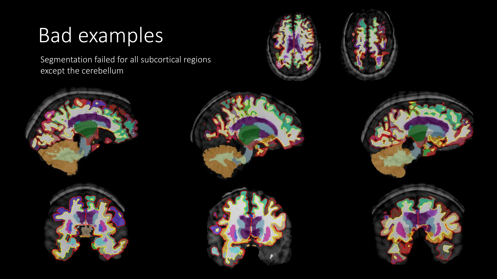
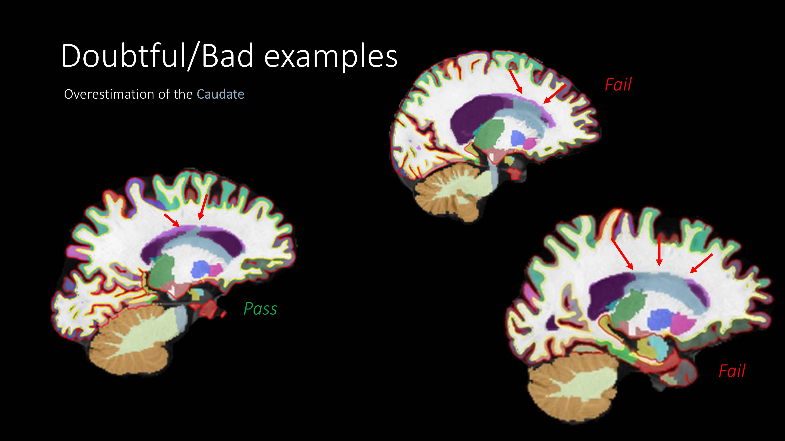
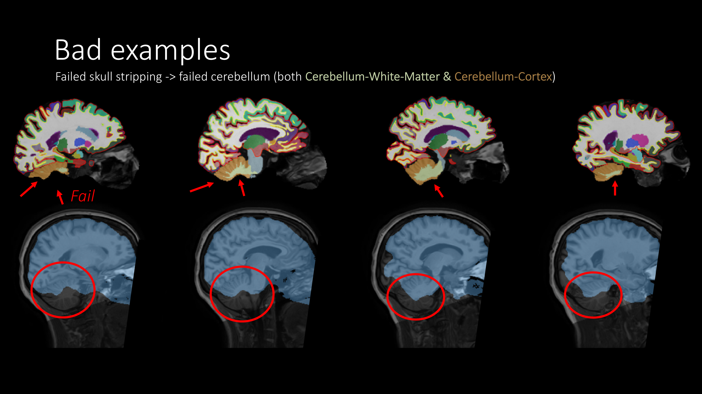

# Subcortical

## 1. What you rate

- The FreeSurfer subcortical segmentation: the colored labels covering the deep brain structures.
- Look at all the structures together. They are located close together, so one look usually covers all of them.
    - Everything looks fine? PASS all structures and move on.
    - Something looks wrong? Figure out which structure(s) are affected, and fail only those. Rate left and right separately (the brainstem is a single region).

### Which regions?

| Group | Structure | Color | Best view |
|---|---|---|---|
| **Basal ganglia** | Caudate | Light blue-gray | Anterior coronal, superior horizontal, lateral sagittal |
| | Putamen | Pink | Coronal, inferior horizontal |
| | Pallidum | Blue | Posterior coronal, inferior horizontal |
| | Accumbens area | Orange | Anterior coronal |
| **Diencephalon** | Thalamus | Green | Posterior coronal, inferior horizontal |
| | Ventral Diencephalon | Salmon | Posterior coronal, medial sagittal |
| **Limbic** | Hippocampus | Yellow | Posterior coronal, lateral sagittal |
| | Amygdala | Cyan | Posterior coronal, lateral sagittal |
| **Brainstem** | Brainstem | Light blue-gray (distinguish from caudate by location) | Medial sagittal |
| **Cerebellum** | Cerebellum white matter | Light yellow-green | Medial and lateral sagittal |
| | Cerebellum cortex | Brown | Medial and lateral sagittal |

Not rated: inferior lateral ventricle (purple) and choroid plexus (teal).

## 2. What you see in QC-Studio

Every participant is shown at the same slice positions. Because brains differ in size and shape, a slice doesn't always land in the same spot in the brain, so a structure may be hard to see in one view. If so, use the other views.

## 3. What to check and how to rate

| Problem | Question to ask | What it looks like | Still PASS | FAIL |
|---|---|---|---|---|
| **Distorted or misplaced structure** | Does each structure have roughly the right shape and position? | A label has a very strange shape or sits in the wrong place. | Minor shape differences or asymmetry between left and right | Very distorted or clearly misplaced |
| **Overestimation** | Does each label stay within its structure? | A label extends into surrounding tissue, for example the caudate spreading over the white matter above the ventricle. | Slight extension at the edge | The label clearly extends along a large stretch of the neighboring tissue |
| **Missing part** | Is the whole structure labeled? | Part of a structure has no label, often the cerebellum after a failed skull strip. | Small bits missing | A large part is missing |
| **Widespread failure** | Do the labels look reasonable overall? | Many or all structures look wrong at the same time, often after motion or a failed skull strip. | — | Fail each affected structure |

- **Errors are rare in the subcortex.** Most structures should pass.
- **Problems are often widespread.** If one structure fails, check its neighbors.

## 4. Examples

### Good segmentation

Coronal view, from posterior to anterior:

Horizontal and sagittal views:

### Common problems

| Problem | What happens | Rating | Example |
|---|---|---|---|
| All structures failed | The segmentation failed for all subcortical structures except the cerebellum | FAIL all affected structures | { width="250" } |
| Caudate overestimated | The caudate label spreads over the white matter above the lateral ventricle | PASS if slight. FAIL if it extends along most of the ventricle | { width="250" } |
| Failed skull strip | The bottom of the cerebellum is cut off by the brain mask, so it's not labeled | FAIL cerebellum white matter and cerebellum cortex | { width="250" } |

### Other situations

| Situation | What to do |
|---|---|
| White matter hypointensities (light purple, often around the ventricles) | Not an error. These are white matter spots that look dark on T1 |
| A structure is hard to see in a view because of the slice position | Use the other views to judge it |
| A problem in one hemisphere only | Fail only that side |
| Part of the cerebellum is cut off in the T1 scan | FAIL cerebellum white matter and cortex on the affected side |
| The T1 quality was poor, but the labels look correct | PASS. Rate the segmentation, not the scan |
| The head was tilted in the scanner, so left and right structures appear at different heights or sizes in the same slice | PASS if each label fits its structure. Check the other views to confirm |
