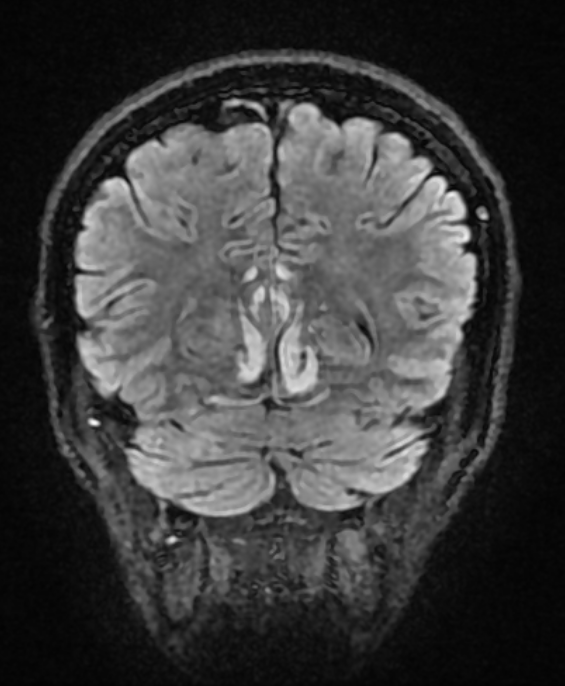
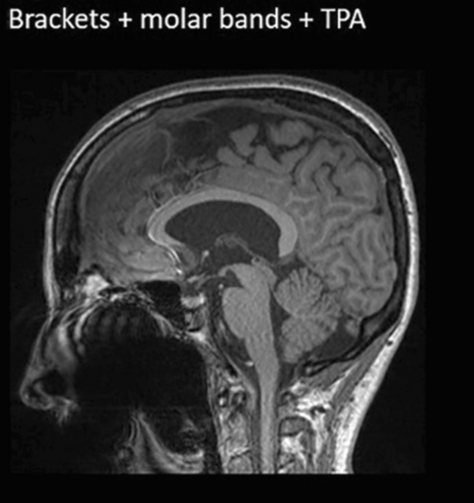

# T1 quality

## 1. What you rate

- The skullstripped T1-weighted image
- Four criteria: **motion**, **coverage**, **signal and contrast**, **other**.

## 2. What you see in QC-Studio

## 3. What to check and how to rate

| Criterion | Question to ask | What the problems look like | Still PASS | FAIL |
|---|---|---|---|---|
| **Motion** | Is the brain free of double images, ripple lines, and blur? | **Blurring:** the person moved during the scan, so the image looks out of focus (like a shaky photo). Gyri and sulci lose their sharp edges, and the gray/white matter border becomes fuzzy.  **Ghosting:** faint copies of the brain appear on top of the real one, as if the image was taken twice. This is often caused by repeated movement, like tremor.  **Ringing:** thin parallel lines that follow the outer edge of the brain, like ripples on water. | The gray/white border is still easy to follow | The gray/white border is hard to follow in large parts of the brain |
| **Coverage** | Is the whole brain visible, with no parts cut off or folded over from the other side? | **Cropping:** part of the brain is cut off at the edge of the image, because it fell outside the captured area (Field of View). You will see a straight, flat edge where the brain should be rounded. This is most common at the top or back of the brain, or at the cerebellum.  **Aliasing (wrap-around):** a part of the head outside the captured area shows up on the wrong side of the image. On these images you only see it if it overlaps the brain, as tissue or a shape that doesn't belong there.  **SENSE ghost**: a specific type of aliasing artefact, where a faint copy of part of the head, often from tissue outside the captured area, shows up inside the image. This is different from motion ghosting, which copies the whole brain. | The bottom of the cerebellum is cut off, do make a note of it | Any part of the cortex is cut off, or wrapped tissue overlaps the brain |
| **Signal and contrast** | Is the image evenly bright and clear enough to tell gray matter from white matter everywhere? | **Uneven brightness (inhomogeneity):** one part of the image is brighter or darker than another, for example the middle is brighter than the edges. A mild version is normal and gets corrected during processing.  **Signal loss (susceptibility):** dark or stretched areas caused by air or metal, usually at the lower edge of the frontal lobes (above the eyes) or temporal lobes (near the ears). A mild version there is normal. Metal in the mouth, such as dental crowns, braces, or implants, can cause a larger dark or warped area that reaches up into these lobes.  **Noise:** the image looks grainy or speckled. | The gray/white border is still visible everywhere | The gray/white border can't be seen in a large area, or signal loss reaches into the brain |
| **Other** | Is the image free of any other problem not covered above? | **Brain pathology:** a visible abnormality in the brain, such as a stroke, tumor, cyst, or large lesion.  **Other artefacts:** anything that doesn't fit the criteria above, for example straight stripes or a strange repeating pattern over the whole image, or an image that doesn't look like a T1 at all.  Please provide more details in the comment field. | The problem is small, stays outside the brain, or is very faint | The problem covers a large part of the brain or makes the gray/white border hard to see |

**Rule of thumb:** motion problems have a shape (copies, lines, smearing), while contrast problems affect how bright or grainy an area looks.

## 4. Examples

### Motion

Severe motion (FAIL):

Moderate motion (FAIL):

### Coverage

Cropped brain:

Aliasing/wrap-around artefact: hippocampus (inverted) shows up in the middle of the brain

Ghosting artefact: specific type of aliasing artefact, a faint copy of part of the head, often from tissue outside the recorded area, shows up inside the image:

### Signal and contrast

B1 inhomogeneity: the centre of the brain looks darker than the rest (and there is a very bright area in the red square), even though the tissue is the same, because the scanner's signal isn't spread evenly across the head.

*Note: this is not a T1-weighted image, but it is shown because it is such a clear example. In T1 scans, the effect is usually milder.*

Dental metal and signal loss: sagittal images with three types of braces, each adding more metal. The more metal there is, the larger the dark, warped area around the mouth, and the closer it gets to the brain.

### Other situations

| Situation | What to do |
|---|---|
| A problem visible in only one view | Rate based on that view |
| Part of the cerebellum cut off | Rate coverage as PASS if the cortex is complete, and add a comment about the cerebellum being cut off. |
